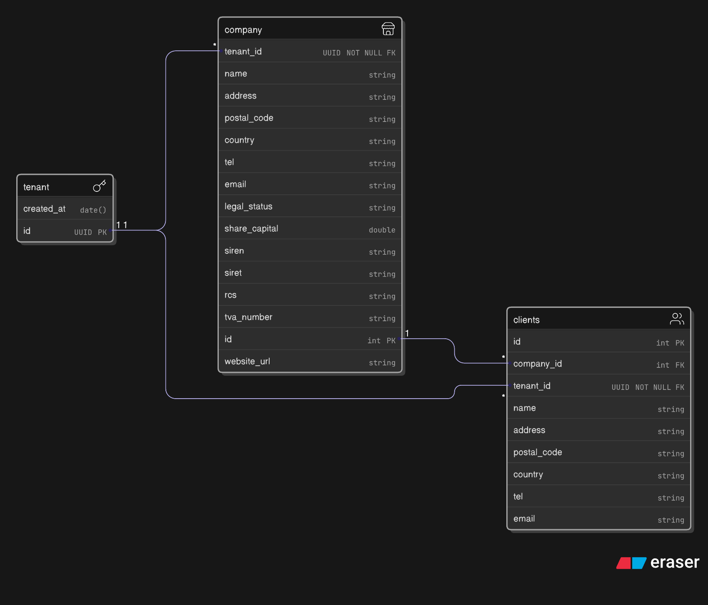

# 📌 CompanyDomain API Documentation

**The CompanyDomain like all REST API in this project relies on multi-tenant**. 

Each HTTP request is authenticated using a **JWT stored in an HTTP-only cookie** ensuring that every domain remains **loosely coupled, fully stateless, and independent**.

The authentication logic is handled by AuthDomain which has control over JWT issuance and refresh. 

**This API :**

- ✅ **Validates** the JWT signature using the shared secret key.  
- ✅ **Extracts** the `tenantId` from JWT claims for data scoping across users.  
- 🔒 **Rejects** any request with an invalid or missing token `401 Unauthorized` by `SecurityConfig`.  
- ✅  **Grants** access only to data belonging to the authenticated tenant.

### Summary
- [Endpoints](#-endpoints)
- [Security Config](#security-config)
- [CompanyDomain SQL Schema](#-companydomain-sql-schema)


## 🔹 Company endpoints - /api/company

### 1. Read company

**GET** `/api/company/`

No id needed, resolution is made by tenantId. Only one company per user or user group.

#### Success Response
```json
{
    "status": "success",
    "code": 200,
    "data": {
        "id": 2,
        "name": "Company",
        "address": "123 Wall Street",
        "postalCode": "75051",
        "country": "US",
        "tel": "+33123456789",
        "email": "contact@acme.com",
        "legalStatus": "SARL",
        "shareCapital": 50000.0,
        "siren": "123456789",
        "siret": "12345678900012",
        "rcs": "RCS Paris B 123 456 789",
        "tvaNumber": "FR12345678901",
        "websiteUrl": "https://www.acme.com"
    }
}
```
#### Error Response 
```json
{
    "status": "error",
    "code": 404,
    "data": "No company registered yet"
}
```

### 2. Create company 

**POST** `/api/company/`

No id needed, resolution is made by tenantId. Only one company per user or user group.

| Parameter      | Type     | Description                               |
| :------------- | :------- | :---------------------------------------- |
| `name`         | `String` | **Required**. Company name                |
| `address`      | `String` | **Required**. Company address             |
| `postalCode`   | `String` | **Required**. Postal code                 |
| `country`      | `String` | **Required**. Country                     |
| `tel`          | `String` | Phone number                              |
| `email`        | `String` | Company email                             |
| `legalStatus`  | `String` | **Required**. Legal form (e.g. SARL, SAS) |
| `shareCapital` | `Double` | **Required**. Share capital               |
| `siren`        | `String` | **Required**. SIREN number (9 digits)     |
| `siret`        | `String` | **Required**. SIRET number (14 digits)    |
| `rcs`          | `String` | **Required**. RCS registration number     |
| `tvaNumber`    | `String` | **Required**. TVA number                  |
| `websiteUrl`   | `String` | Company website URL (optional)            |

#### Request Body
```json
{
  "name": "My Company",
  "address": "123 Main Street",
  "country": "France",
  "postalCode": "75051",
  "tel": "+33123456789",
  "email": "contact@acme.com",
  "legalStatus": "SARL",
  "shareCapital": 50000.00,
  "siren": "123456789",
  "siret": "12345678900012",
  "rcs": "RCS Paris B 123 456 789",
  "tvaNumber": "FR12345678901",
  "websiteUrl": "https://www.acme.com"
}
```
#### Success Response
```json
{
    "status": "success",
    "code": 200,
    "data": {
        "id": 3,
        "name": "My Company",
        "address": "123 Main Street",
        "postalCode": "75051",
        "country": "France",
        "tel": "+33123456789",
        "email": "contact@acme.com",
        "legalStatus": "SARL",
        "shareCapital": 50000.0,
        "siren": "123456789",
        "siret": "12345678900012",
        "rcs": "RCS Paris B 123 456 789",
        "tvaNumber": "FR12345678901",
        "websiteUrl": "https://www.acme.com"
    }
}
```

#### Missing Required Parameter
```json
{
    "country": "Country is required"
}
```

#### Error Response 
```json
{
    "status": "error",
    "code": 400,
    "data": "No more than one company per user"
}
```

### 3. Update company 

**PUT** `/api/company/`

No id needed, resolution is made from tenantId. Only one company per user or user group.

| Parameter      | Type     | Description                               |
| :------------- | :------- | :---------------------------------------- |
| `name`         | `String` | **Required**. Company name                |
| `address`      | `String` | **Required**. Company address             |
| `postalCode`   | `String` | **Required**. Postal code                 |
| `country`      | `String` | **Required**. Country                     |
| `tel`          | `String` | Phone number                              |
| `email`        | `String` | Company email                             |
| `legalStatus`  | `String` | **Required**. Legal form (e.g. SARL, SAS) |
| `shareCapital` | `Double` | **Required**. Share capital               |
| `siren`        | `String` | **Required**. SIREN number (9 digits)     |
| `siret`        | `String` | **Required**. SIRET number (14 digits)    |
| `rcs`          | `String` | **Required**. RCS registration number     |
| `tvaNumber`    | `String` | **Required**. TVA number                  |
| `websiteUrl`   | `String` | Company website URL (optional)            |

#### Request Body
```json
{
  "name": "My new Company name",
  "address": "123 Wall Street",
  "country": "US",
  "postalCode": "75051",
  "tel": "+33123456789",
  "email": "contact@acme.com",
  "legalStatus": "SARL",
  "shareCapital": 50000.00,
  "siren": "123456789",
  "siret": "12345678900012",
  "rcs": "RCS Paris B 123 456 789",
  "tvaNumber": "FR12345678901",
  "websiteUrl": "https://www.acme.com"
}
```

#### Success Response
```json
{
    "status": "success",
    "code": 200,
    "data": {
        "id": 3,
        "name": "My new Company name",
        "address": "123 Main Street",
        "postalCode": "75051",
        "country": "France",
        "tel": "+33123456789",
        "email": "contact@acme.com",
        "legalStatus": "SARL",
        "shareCapital": 50000.0,
        "siren": "123456789",
        "siret": "12345678900012",
        "rcs": "RCS Paris B 123 456 789",
        "tvaNumber": "FR12345678901",
        "websiteUrl": "https://www.acme.com"
    }
}
```
#### Error Response (if not user company or not found)
```json
{
    "status": "error",
    "code": 404,
    "data": "Company id not found"
}
```


## 🔹 Client endpoints - /api/company/{companyId}/client

### 1. Read client

**GET** `/api/company/{companyId}/client?page=0`


Endpoint must have **query parameter :** `?page={int}`. Backend enforces pagination logic to limit results to 20 per page. 

View must adapt to ease navigation through clients using pagination. 

If companyId is wrong or not user's id, this just returns empty array for `data.content`. 

#### Success Response
```json
{
    "status": "success",
    "code": 200,
    "data": {
        "content": [
            {
                "id": 4,
                "name": "GeoCorp",
                "address": "10 Rue Lacassane",
                "postalCode": "75002",
                "country": "France",
                "tel": "+33 1 11 22 33 44",
                "email": "clientA@example.com"
            },
            {
                "id": 5,
                "name": "Josh",
                "address": "10 Rue Charle Edouard",
                "postalCode": "83002",
                "country": "France",
                "tel": "+33 1 11 22 33 44",
                "email": "clientB@example.com"
            },
            {
                "id": 6,
                "name": "Pathe Gaumont",
                "address": "10 Rue La Place",
                "postalCode": "51002",
                "country": "France",
                "tel": "+33 1 11 22 33 44",
                "email": "clientC@example.com"
            }
        ],
        "pageable": {
            "pageNumber": 0,
            "pageSize": 20,
            "sort": {
                "sorted": false,
                "empty": true,
                "unsorted": true
            },
            "offset": 0,
            "paged": true,
            "unpaged": false
        },
        "totalPages": 1,
        "totalElements": 3,
        "last": true,
        "size": 20,
        "number": 0,
        "sort": {
            "sorted": false,
            "empty": true,
            "unsorted": true
        },
        "numberOfElements": 3,
        "first": true,
        "empty": false
    }
}
```


### 2. Create client

**POST** `/api/company/{companyId}/client`


To create a client pass `companyId` as **request parameter**. 

| Parameter      | Type     | Description                               |
| :------------- | :------- | :---------------------------------------- |
| `name`         | `String` | **Required**. Company name                |
| `address`      | `String` | **Required**. Company address             |
| `postalCode`   | `String` | **Required**. Postal code                 |
| `country`      | `String` | **Required**. Country                     |
| `tel`          | `String` | Phone number                              |
| `email`        | `String` | Company email                             |


#### Request Body
```json
{
  "name":"Mosanto",
  "address": "10 Rue Rivoli",
  "postalCode": "75002",
  "country": "France",
  "tel": "+33 1 11 22 33 44",
  "email": "clientA@example.com"
}
```

#### Success Response
```json
{
    "status": "success",
    "code": 200,
    "data": {
        "id": 7,
        "name": "Mosanto",
        "address": "10 Rue Rivoli",
        "postalCode": "75002",
        "country": "France",
        "tel": "+33 1 11 22 33 44",
        "email": "clientA@example.com"
    }
}
```
#### Missing field
```json
{
    "name": "Company name is required"
}
```

### 3. Update client

**PUT** `/api/company/{companyId}/client/{id}`

To update client data pass `companyId` and `id` as **request parameter**. 

| Parameter      | Type     | Description                               |
| :------------- | :------- | :---------------------------------------- |
| `name`         | `String` | **Required**. Company name                |
| `address`      | `String` | **Required**. Company address             |
| `postalCode`   | `String` | **Required**. Postal code                 |
| `country`      | `String` | **Required**. Country                     |
| `tel`          | `String` | Phone number                              |
| `email`        | `String` | Company email                             |


#### Request Body
```json
{
  "name":"Pathe Gaumont",
  "address": "10 Rue Rivoli",
  "postalCode": "75002",
  "country": "France",
  "tel": "+33 1 11 22 33 44",
  "email": "clientA@example.com"
}
```

#### Success Response
```json
{
    "status": "success",
    "code": 200,
    "data": {
        "id": 6,
        "name": "Pathe Gaumont",
        "address": "10 Rue Rivoli",
        "postalCode": "75002",
        "country": "France",
        "tel": "+33 1 11 22 33 44",
        "email": "clientA@example.com"
    }
}
```

#### Missing field
```json
{
    "name": "Company name is required"
}
```

## CompanyDomain SQL Schema


The SQL schema relies on tenant reference table to ensure **strong boundaries and scope across client and company tables**. By being external and not only part of **Shared schema (tenantId Column)**, this enforces consistency and integrity of `tenant_id` by referring to its external key.



```sql
/*
    Company - Domain
*/

CREATE EXTENSION IF NOT EXISTS "pgcrypto";

CREATE TABLE tenant (
    id UUID PRIMARY KEY,
    created_at TIMESTAMP NOT NULL DEFAULT NOW()
);

CREATE TABLE company ( 
    id SERIAL PRIMARY KEY,
    tenant_id UUID NOT NULL REFERENCES tenant(id) -- /!\ tenant_id from JWT in all request. ensure boundaries, data consitency and scope
        ON DELETE CASCADE
        ON UPDATE CASCADE,
    name VARCHAR(128) NOT NULL,
    address VARCHAR(255) NOT NULL,
    postal_code VARCHAR(20) NOT NULL,
    country VARCHAR(64) NOT NULL,
    tel VARCHAR(20),
    email VARCHAR(254),
    legal_status VARCHAR(64) NOT NULL,            -- e.g., SARL, SAS, SA...
    share_capital DECIMAL(15,2) NOT NULL,         -- numeric with decimals, allows big values
    siren CHAR(9) NOT NULL,                       -- French SIREN = 9 digits
    siret CHAR(14) NOT NULL,                      -- French SIRET = 14 digits
    rcs VARCHAR(64) NOT NULL,                     -- registry of commerce info
    tva_number VARCHAR(32) NOT NULL,              -- EU VAT number format varies
    website_url VARCHAR(255)
);

-- Optimization 
CREATE INDEX idx_company_tenant ON company (tenant_id); -- use index to faster search by tenant_id
CREATE INDEX idx_company_tenant_name ON company (tenant_id, name); -- use index to faster search by tenant_id & compapny name

CREATE TABLE client (
    id SERIAL PRIMARY KEY,
    tenant_id UUID NOT NULL REFERENCES tenant(id) -- /!\ tenant_id from JWT in all request. ensure boundaries, data consitency and scope
        ON DELETE CASCADE
        ON UPDATE CASCADE,
    company_id INT NOT NULL REFERENCES company(id) -- FK to the user_company
        ON DELETE CASCADE
        ON UPDATE CASCADE,
    name VARCHAR(128) NOT NULL,
    address VARCHAR(255) NOT NULL,
    postal_code VARCHAR(20) NOT NULL,
    country VARCHAR(64) NOT NULL,
    tel VARCHAR(20),
    email VARCHAR(254)
);

CREATE INDEX idx_client_tenant ON client (tenant_id);
CREATE INDEX idx_client_company ON client (company_id);
```

## Security config

**JwtAuthFilter** validates the token signature and extracts payload claims using a **symmetric key** from environment variables.  
It populates Spring Security `Authentication` object, which is accessible throughout the request lifecycle (controllers, services, etc.) via the **SecurityContextHolder**, which is thread accessible along request and cleared after response.

The JWT payload is stored inside the `authToken` object and can be accessed through the injected `Authentication` in any application layer using its class.

```java
// Validate JWT 
Claims claims = validateToken(token);

// Build authentication token - set claims in getPrincipal()
UsernamePasswordAuthenticationToken authToken =  new UsernamePasswordAuthenticationToken(claims, null, Collections.emptyList());

// Optional - attach WebAuthenticationDetailsSource to metadata like client ip address for instance. 
authToken.setDetails(new WebAuthenticationDetailsSource().buildDetails(request));

// Set authentication in context
SecurityContextHolder.getContext().setAuthentication(authToken);//set authToken wrapping claims

// Pass next 
filterChain.doFilter(request, response);
```

**Each HTTP request embeds CORS rules due to disabled CSRF on HttpSecurity.**

All HTTP requests are stateless. No sessions are created with frontend. Everything relies on JWT only as source of truth. Therefore, all requests are filtered by JwtAuthFilter.

```java
@Bean
    SecurityFilterChain filterChain(HttpSecurity http) throws Exception
    {

        http.cors(cors -> cors.configurationSource(corsConfigurationSource()))
            .authorizeHttpRequests(auth -> auth
                .requestMatchers("/api/**").permitAll()
                .anyRequest().authenticated()
            )
            //this must be enforced by strong CORS rules. No XSRF-TOKEN. JWT go stateless
            .csrf(csrf -> csrf.disable()) 
            //JWT is stateless no need to rely on sessions 
            .sessionManagement(session -> session.sessionCreationPolicy(SessionCreationPolicy.STATELESS))
            //Filter header and extract JWT payload to be used by controller, services ... 
            .addFilterBefore(new JwtAuthFilter(privateKey), UsernamePasswordAuthenticationFilter.class);
        
        return http.build();
    }

```

